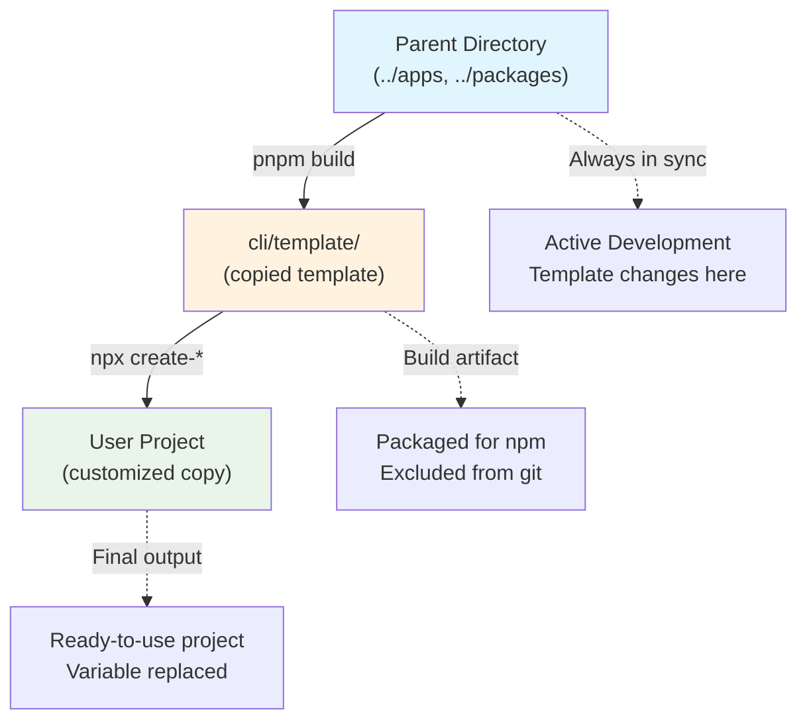

# CLI Generator (`create-fastify-react-router`)

This directory contains the CLI generator that creates new projects from the living template. The CLI is published to npm as `create-fastify-react-router`.

## Architecture Overview

The CLI uses a **"living template"** approach:



**Flow**:

1. **Template Source**: The parent directory (`../`) serves as the living template
2. **Build-Time Copy**: During `pnpm build`, the template is copied to `cli/template/`
3. **Runtime Generation**: When users run the CLI, it copies from `cli/template/` and customizes it

This ensures the template is always up-to-date with the latest project changes.

## Key Files and Responsibilities

### Core CLI Logic

- **`src/index.ts`** - Main CLI entry point, argument parsing with Commander.js
- **`src/create-project.ts`** - Project creation orchestration and validation
- **`src/utils/validation.ts`** - Input validation and project name checking

### Template Processing

- **`src/utils/copy-template.ts`** - Runtime template copying with exclusions
- **`src/utils/replace-vars.ts`** - Variable replacement system (project names, scopes)
- **`src/utils/prompts.ts`** - Interactive prompts for missing options

### Build System

- **`scripts/copy-template.js`** - Build-time template copying for npm packaging
- **`package.json`** - CLI package configuration and dependencies
- **`tsconfig.json`** - TypeScript configuration for CLI

### Generated Artifacts

- **`dist/`** - Compiled JavaScript (gitignored)
- **`template/`** - Copied template files (gitignored, created during build)

## Development Workflow

### Setup

```bash
cd cli
pnpm install
```

### Development Commands

```bash
# Build CLI (TypeScript + template copy)
pnpm build

# Development mode (TypeScript compilation only)
pnpm dev

# Type checking
pnpm typecheck

# Clean build artifacts
pnpm clean
```

### Testing Locally

```bash
# Build first
pnpm build

# Test CLI generation
node dist/index.js test-project --no-install --no-git

# Test with different options
node dist/index.js test-postgres --db postgres --no-install
node dist/index.js test-eslint --lint eslint --no-install
node dist/index.js test-none --orm none --no-install

# Clean up
rm -rf test-*
```

## Template Processing System

### Exclusion Patterns

The CLI excludes certain files/directories when copying the template:

```typescript
const EXCLUDE_PATTERNS = [
  "node_modules",
  ".git",
  "cli", // Build artifacts and self-reference
  ".turbo",
  "dist",
  "build", // Build outputs
  ".github",
  "CONTRIBUTING.md", // Development files
  ".env",
  ".env.local", // Environment files (only .env.example copied)
  "**/Dockerfile",
  "**/.dockerignore", // Docker files
];
```

### Variable Replacement

The CLI replaces these template variables throughout the generated project:

```typescript
const TEMPLATE_VARS = {
  "fastify-react-router-starter": projectName,
  "@fastify-react-router-starter": `@${projectName}`,
  "Jarod Taylor": "Your Name",
  "jarodrtaylor@gmail.com": "your.email@example.com",
  // Repository URLs, etc.
};
```

**Files processed**: `package.json`, TypeScript files, configuration files, documentation

### Configuration Options

The CLI handles these customization options:

- **Database**: `sqlite` (default), `postgres`, `mysql`
- **ORM**: `prisma` (default), `none`
- **Linter**: `biome` (default), `eslint`
- **Setup**: `--install/--no-install`, `--git/--no-git`

Each option triggers specific template modifications in `replace-vars.ts`.

## Project Validation

The CLI validates generated projects to ensure they're set up correctly:

```typescript
async function validateProject(projectPath: string, options: ProjectOptions) {
  // 1. Check if node_modules exists (dependencies installed)
  // 2. Verify required packages are present
  // 3. Return validation status
}
```

**Validation outcomes**:

- ✅ **Success**: All dependencies installed, ready to use
- ⚠️ **Partial**: Project created but needs manual setup
- ❌ **Error**: Project creation failed

## Error Handling

The CLI provides clear error messages and recovery instructions:

- **Invalid inputs**: Clear validation messages with valid options
- **File system errors**: Graceful handling of permissions, existing directories
- **Network failures**: Fallback instructions for manual setup
- **Partial failures**: Step-by-step recovery instructions

## Adding New CLI Options

1. **Update CLI interface** (`src/index.ts`):

   ```typescript
   .option('--new-option <value>', 'Description', 'default')
   ```

2. **Add to TypeScript interface** (`src/create-project.ts`):

   ```typescript
   export interface ProjectOptions {
     newOption: string;
   }
   ```

3. **Handle in processing**:
   - Add to `promptForOptions()` if needed
   - Implement logic in `replaceTemplateVars()`
   - Add validation in `validateProjectOptions()`

## Publishing

The CLI is published to npm as `create-fastify-react-router`:

```bash
# Build and test locally first
pnpm build
node dist/index.js test-publish --no-install --no-git

# Publish to npm
npm publish

# Test published version
npx create-fastify-react-router@latest test-published --no-install
```

## Dependencies

### Runtime Dependencies

- **Commander.js**: CLI argument parsing and help generation
- **Inquirer**: Interactive prompts for missing options
- **Ora**: Loading spinners and progress indicators
- **Chalk**: Colored terminal output
- **Execa**: Process execution for git, pnpm commands

### Build Dependencies

- **TypeScript**: Type checking and compilation
- **Node.js built-ins**: File system operations, path manipulation

## Debugging

### Common Issues

**Template not copying correctly**:

```bash
ls cli/template/packages/  # Should include database, shared-utils, etc.
```

**Variable replacement not working**:

```bash
grep -r "fastify-react-router-starter" generated-project/  # Should be minimal
```

**CLI validation failing**:

```bash
cd cli && pnpm build  # Rebuild after validation changes
node dist/index.js test --db invalid  # Test error handling
```

### Verbose Output

```bash
# Enable debug output for template copying
DEBUG=copy-template node dist/index.js test-debug

# Check TypeScript compilation
pnpm typecheck --verbose
```

## Testing

See the [Validation Patterns](../CONTRIBUTING.md#validation-patterns-and-workflows) section in CONTRIBUTING.md for comprehensive testing workflows.

### Quick Tests

```bash
# Input validation
node dist/index.js test --db invalid    # Should error
node dist/index.js test --orm none      # Should warn about db option

# Structure validation
node dist/index.js test --no-install --no-git
ls test/packages/                       # Should include all packages
```

## Related Files

- **`../CONTRIBUTING.md`** - Comprehensive development and testing workflows
- **`../package.json`** - Root project configuration and scripts
- **`../turbo.json`** - Monorepo build configuration
- **`../apps/`** and **`../packages/`** - Template source files
